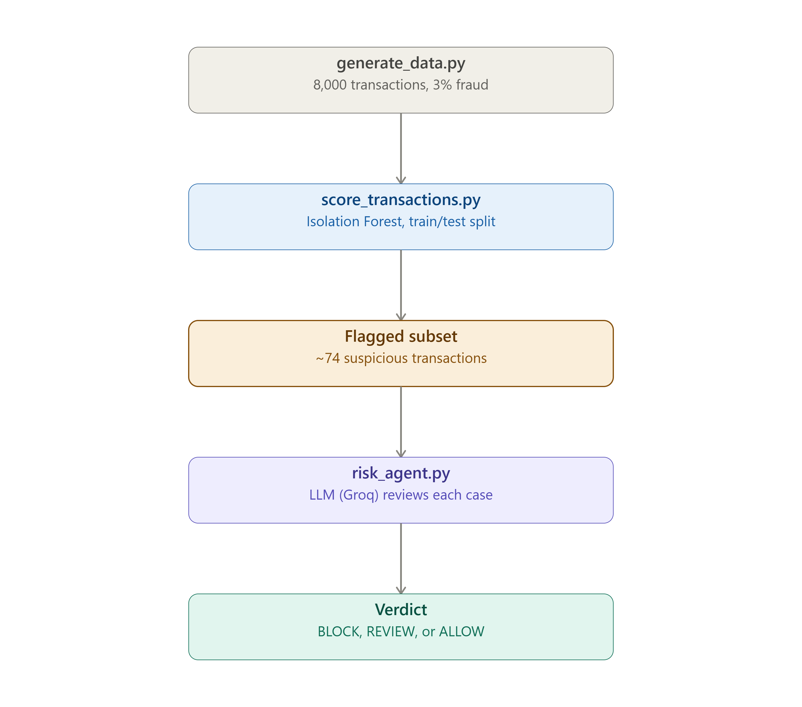

# AI Risk Manager

An AI agent that reviews payment transactions flagged as suspicious and explains — in plain English — whether to block, review, or allow them, the way a human risk analyst would.

## The problem

Payment platforms process huge volumes of transactions. Simple statistical checks can flag something as "unusual," but a flag alone isn't a decision — someone still has to figure out why it's unusual and what to do about it. This project closes that gap: it takes a flagged transaction and produces a reasoned, explainable verdict, instead of just a number.
## Architecture

Five stages, each one a separate script: `generate_data.py` creates the synthetic transactions, `score_transactions.py` runs Isolation Forest and splits into train/test, the flagged subset goes to `risk_agent.py` for LLM review, and each case gets a final BLOCK/REVIEW/ALLOW verdict with a plain-English reason.

1. generate_data.py - creates ~2,000 realistic mobile payment transactions (type, amount, sender/receiver balances before and after), with a small percentage seeded as fraud. Structured like the well-known PaySim dataset, generated locally so the project has no external data dependency.

2. score_transactions.py - splits the data into train/test sets, trains an Isolation Forest model on the train set only, then scores the held-out test set. Isolation Forest is unsupervised - it does not need fraud labels to work, it just finds transactions that do not fit the pattern of normal behavior. Because the test set's true labels are known (but hidden from the model), this step also computes real precision, recall, and false-positive counts.

3. risk_agent.py - the AI agent. For each flagged transaction, it builds a short case description and sends it to an LLM via Groq with a specific role: "You are a payments risk analyst." The agent replies with a verdict - BLOCK, REVIEW, or ALLOW - and a plain-English reason.

main.py runs all three steps in order - one command, full pipeline.
 
## Results (held-out test set)

Test set: 2,400 transactions, 81 of them actual fraud.

- **Precision: 62%** — of the 74 transactions flagged, 46 were real fraud, 28 were false alarms.
- **Recall: 57%** — caught 46 of the 81 actual fraud cases in the test set; missed 35.
- **False positives: 28** — each one means a legitimate customer's transaction gets held for manual review. At even a conservative 5 minutes of analyst time per review, that's over 2 hours of manual work generated by one batch of 2,400 transactions — a real operational cost, not just a metric.
- **BLOCK accuracy: 41 of 42 BLOCK verdicts were correct (97.6%)** — only one legitimate transaction was confidently blocked. The remaining 27 false positives all landed in REVIEW or ALLOW, meaning uncertainty stayed in the cautious categories rather than causing a costly, confident mistake in the vast majority of cases.
Every BLOCK verdict was correct - the agent never confidently blocked a legitimate transaction. The 9 false positives all landed in REVIEW or ALLOW, meaning uncertainty stayed in the cautious categories rather than causing a costly, confident mistake.

## Dashboard

app.py is a Streamlit dashboard showing the metrics summary and every investigated transaction with its verdict and reasoning.

streamlit run app.py

## What broke, and what I would do next

Original attempt: a 5-agent orchestrated pipeline. This broke repeatedly at the orchestration step, and became something I was following instructions for rather than understanding. I scaled it down to one agent doing focused reasoning on one case at a time, which I can fully explain and defend.

During the metrics/agent build: hit a hard daily quota wall on Gemini's free tier (20 requests/day, below the 22 transactions this project investigates). Diagnosed it from the error message and switched the agent to Groq's API instead, which resolved it completely.

What's next: the natural next step is the multi-agent version I originally attempted, built on top of a foundation that actually works.

## How to run

pip install -r requirements.txt
$env:GROQ_API_KEY="your-key-here"
python main.py

Output lands in risk_report.csv. Run streamlit run app.py afterward for the dashboard view.

## Track

AI Risk Manager - a working fraud-spike detector with measured precision, recall, and false-positive cost on a held-out test set.
